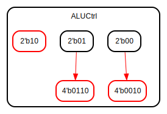

# Entity: ALUControl

- **File**: ALUControl.v
## Diagram

## Description

 Generate signal to control ALU based on the main control line ALUOp + 
 instruction decodificated Func7 + Func3.
 | Instruction Format | Instruction | Desired ALU action | ALUOp1 | ALUOp0 | I\[30\] | I\[14\] | I\[13\] | I\[12\] | ALUCtrl |
 | ------------------ | ----------- | ------------------ | ------ | ------ | ------- | ------- | ------- | ------- | ------- |
 | I                  | lw          | add                | 0      | 0      | x       | x       | x       | x       | 0010    |
 | S                  | sw          | add                | 0      | 0      | x       | x       | x       | x       | 0010    |
 | B                  | beq         | substract          | 0      | 1      | x       | x       | x       | x       | 0110    |
 | R                  | add         | add                | 1      | 0      | 0       | 0       | 0       | 0       | 0010    |
 | R                  | sub         | substract          | 1      | 0      | 1       | 0       | 0       | 0       | 0110    |
 | R                  | and         | AND                | 1      | 0      | 0       | 1       | 1       | 1       | 0000    |
 | R                  | or          | OR                 | 1      | 0      | 0       | 1       | 1       | 0       | 0001    |

## Ports

| Port name | Direction | Type  | Description      |
| --------- | --------- | ----- | ---------------- |
| ALUOp     | input     | [1:0] | From MainControl |
| Func7     | input     |       | From instruction |
| Func3     | input     | [2:0] | From instruction |
| ALUCtrl   | output    | [3:0] |                  |
## Signals

| Name | Type       | Description |
| ---- | ---------- | ----------- |
| Func | wire [3:0] |             |
## Processes
- AluControl: ( @(*) )
  - **Type:** always
## State machines

