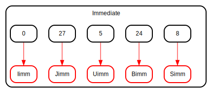

# Entity: ImmGen

- **File**: ImmGen.v
## Diagram

## Description

 Decode instruction for every format and choose the one needed based on opcode.

## Ports

| Port name   | Direction | Type   | Description |
| ----------- | --------- | ------ | ----------- |
| Instruction | input     | [31:0] |             |
| Immediate   | output    | [31:0] |             |
## Signals

| Name   | Type       | Description                                                        |
| ------ | ---------- | ------------------------------------------------------------------ |
| Opcode | reg [6:2]  | Instruction identification to select the instruction format needed |
| Simm   | reg [31:0] | S format immediate                                                 |
| Bimm   | reg [31:0] | B format immediate                                                 |
| Uimm   | reg [31:0] | U format immediate                                                 |
| Jimm   | reg [31:0] | J format immediate                                                 |
| Iimm   | reg [31:0] | I format immediate                                                 |
## Processes
- FormatSelect: ( @(*) )
  - **Type:** always
  - **Description**
  Decode muxed select of the immediate format based on the opcode of the instruction 
## State machines

- Decode muxed select of the immediate format based on the opcode of the instruction