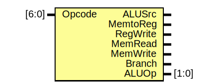

# Entity: MainControl

- **File**: MainControl.v
## Diagram

## Description

 Main control unit. Generate control lanes based on the Opcode selected
 and ALUOp to ALUControl.v as a 2 levels control abstraction.

## Ports

| Port name | Direction | Type  | Description                                                                       |
| --------- | --------- | ----- | --------------------------------------------------------------------------------- |
| Opcode    | input     | [6:0] | Opcode from Instruction                                                           |
| ALUSrc    | output    |       | Select the source to ALU input ***b*** between **RegisterFile / Immediate**       |
| MemtoReg  | output    |       | Select the source to Register File WriteData between **ALU Result / Data Memory** |
| RegWrite  | output    |       | Enable Register File WriteEn                                                      |
| MemRead   | output    |       | Enable Data Memory read                                                           |
| MemWrite  | output    |       | Enable Data Memory write                                                          |
| Branch    | output    |       | Select new branching program counter (if ALU also sets zero lane)                 |
| ALUOp     | output    | [1:0] | Previous instruction decodification to simplify ALUControl.                       |
## Processes
- OpcodeDecode: ( @(*) )
  - **Type:** always
