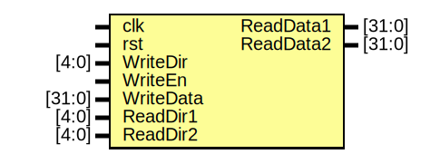

# Entity: RegisterFile

- **File**: RegisterFile.v
## Diagram

## Description

 Register file. Synchronous write. Asynchronous read.

## Ports

| Port name | Direction | Type   | Description                                                            |
| --------- | --------- | ------ | ---------------------------------------------------------------------- |
| clk       | input     |        |                                                                        |
| rst       | input     |        | High level asynchronous reset as its better to simulate with debouncer |
| WriteDir  | input     | [4:0]  |                                                                        |
| WriteEn   | input     |        |                                                                        |
| WriteData | input     | [31:0] |                                                                        |
| ReadDir1  | input     | [4:0]  |                                                                        |
| ReadDir2  | input     | [4:0]  |                                                                        |
| ReadData1 | output    | [31:0] |                                                                        |
| ReadData2 | output    | [31:0] |                                                                        |
## Signals

| Name | Type       | Description                            |
| ---- | ---------- | -------------------------------------- |
| bank | reg [31:0] | Internal memory state of the registers |
| i    | integer    | Index to reset *multidimensional* bank |
## Processes
- WriteBank: ( @(posedge clk) )
  - **Type:** always
  - **Description**
  Write the register bank (except zero) if enabled 
